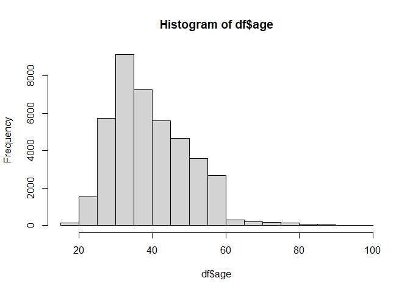
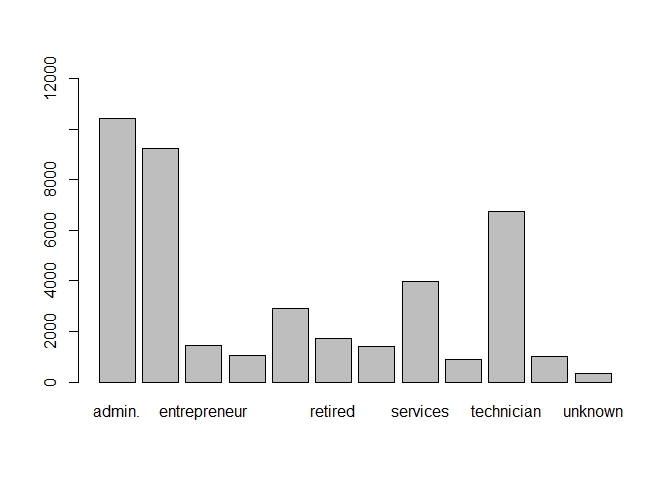
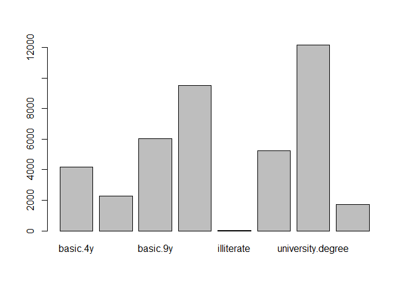
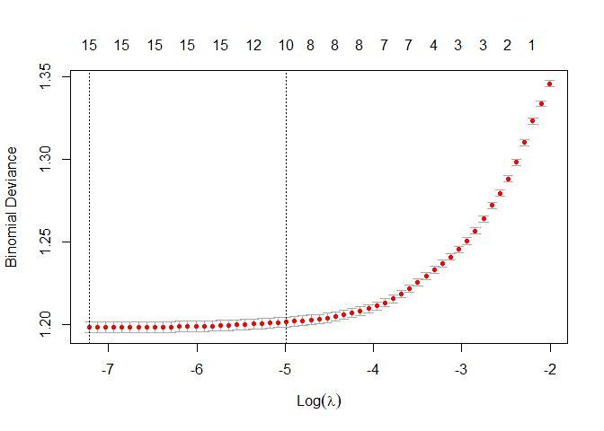

machine learning demonstration
================
Reynaldi Ikhsan Kosasih
2023-01-29

# machine learning

We are going to use the bank_data to predict whether the direct
marketing campaign of a Portuguese bank was successful. The
classification goal is to predict if the client will subscribe a term
deposit (variable y).

## load necessary library

``` r
#these are my 'default' packages when working with r

library(ggplot2) #create advanced and sophisticating plot
library(tidyverse) #tidying columns, row, etc
```

    ## ── Attaching packages ─────────────────────────────────────── tidyverse 1.3.2 ──
    ## ✔ tibble  3.1.8      ✔ dplyr   1.0.10
    ## ✔ tidyr   1.2.1      ✔ stringr 1.4.1 
    ## ✔ readr   2.1.3      ✔ forcats 0.5.2 
    ## ✔ purrr   0.3.5      
    ## ── Conflicts ────────────────────────────────────────── tidyverse_conflicts() ──
    ## ✖ dplyr::filter() masks stats::filter()
    ## ✖ dplyr::lag()    masks stats::lag()

``` r
library(flextable) #flextable are designed to make tabular reporting easier for R users
```

    ## 
    ## Attaching package: 'flextable'
    ## 
    ## The following object is masked from 'package:purrr':
    ## 
    ##     compose

``` r
library(summarytools) #summary of basic statistics
```

    ## 
    ## Attaching package: 'summarytools'
    ## 
    ## The following object is masked from 'package:tibble':
    ## 
    ##     view

``` r
library(dplyr) #manipulate dataframe
library(readxl) #read excel file
library(writexl) #export to excel

#create a value consists of 25 distinct colors for better plots customization
c25 <- c(
  "dodgerblue2", "#E31A1C", # red
  "green4",
  "#6A3D9A", # purple
  "#FF7F00", # orange
  "black", "gold1",
  "skyblue2", "#FB9A99", # lt pink
  "palegreen2",
  "#CAB2D6", # lt purple
  "#FDBF6F", # lt orange
  "gray70", "khaki2",
  "maroon", "orchid1", "deeppink1", "blue1", "steelblue4",
  "darkturquoise", "green1", "yellow4", "yellow3",
  "darkorange4", "brown"
)
```

## load data

``` r
library(readxl)
df <- read_excel("D:/Portfolio/clone/bank-additional-full.xlsx", 
    col_types = c("numeric", "text", "text", 
        "text", "text", "text", "text", "text", 
        "text", "text", "numeric", "numeric", 
        "numeric", "numeric", "text", "numeric", 
        "numeric", "numeric", "numeric", 
        "numeric", "text"))
```

# check histogram and descriptive plot of predictors

``` r
hist(df$age)
```

<!-- -->

``` r
descr(df$age)
```

    ## Descriptive Statistics  
    ## df$age  
    ## N: 41188  
    ## 
    ##                          age
    ## ----------------- ----------
    ##              Mean      40.02
    ##           Std.Dev      10.42
    ##               Min      17.00
    ##                Q1      32.00
    ##            Median      38.00
    ##                Q3      47.00
    ##               Max      98.00
    ##               MAD      10.38
    ##               IQR      15.00
    ##                CV       0.26
    ##          Skewness       0.78
    ##       SE.Skewness       0.01
    ##          Kurtosis       0.79
    ##           N.Valid   41188.00
    ##         Pct.Valid     100.00

``` r
barplot(table(df$job), ylim = c(0, 12000))
```

<!-- -->

``` r
freq(df$job)
```

    ## Frequencies  
    ## df$job  
    ## Type: Character  
    ## 
    ##                        Freq   % Valid   % Valid Cum.   % Total   % Total Cum.
    ## ------------------- ------- --------- -------------- --------- --------------
    ##              admin.   10422     25.30          25.30     25.30          25.30
    ##         blue-collar    9254     22.47          47.77     22.47          47.77
    ##        entrepreneur    1456      3.54          51.31      3.54          51.31
    ##           housemaid    1060      2.57          53.88      2.57          53.88
    ##          management    2924      7.10          60.98      7.10          60.98
    ##             retired    1720      4.18          65.15      4.18          65.15
    ##       self employed    1421      3.45          68.60      3.45          68.60
    ##            services    3969      9.64          78.24      9.64          78.24
    ##             student     875      2.12          80.37      2.12          80.37
    ##          technician    6743     16.37          96.74     16.37          96.74
    ##          unemployed    1014      2.46          99.20      2.46          99.20
    ##             unknown     330      0.80         100.00      0.80         100.00
    ##                <NA>       0                               0.00         100.00
    ##               Total   41188    100.00         100.00    100.00         100.00

``` r
barplot(table(df$education), ylim = c(0, 12000))
```

<!-- -->

``` r
freq(df$education)
```

    ## Frequencies  
    ## df$education  
    ## Type: Character  
    ## 
    ##                              Freq   % Valid   % Valid Cum.   % Total   % Total Cum.
    ## ------------------------- ------- --------- -------------- --------- --------------
    ##                  basic.4y    4176    10.139         10.139    10.139         10.139
    ##                  basic.6y    2292     5.565         15.704     5.565         15.704
    ##                  basic.9y    6045    14.677         30.380    14.677         30.380
    ##               high.school    9515    23.101         53.482    23.101         53.482
    ##                illiterate      18     0.044         53.525     0.044         53.525
    ##       professional.course    5243    12.729         66.255    12.729         66.255
    ##         university.degree   12168    29.543         95.797    29.543         95.797
    ##                   unknown    1731     4.203        100.000     4.203        100.000
    ##                      <NA>       0                              0.000        100.000
    ##                     Total   41188   100.000        100.000   100.000        100.000

# remove unnecessary variables and recode categorical variables for simpler categorization

``` r
df <- subset(df, select = -c(5, 9:11, 13, 15:20))

df$age <- as.factor(cut(df$age, breaks = c(0,30,45,99), labels = c("30 and under","31 to 45", "46 and over")))

df$education <- recode(df$education, illiterate = "basic", unknown = "basic", basic.4y = "basic", basic.6y = "basic", basic.9y ="basic")

df$job <- recode(df$job, student = "retired or unemployed", unknown = "retired or unemployed", housemaid = "services", technician = "blue-collar", admin. = "management", "self employed" = "services", retired = "retired or unemployed", unemployed = "retired or unemployed")

df[df == 'unknown'] <- NA
```

# remove missing data and check the proportion of outcome variables

``` r
df <- na.omit(df)
df <- rename(df, deposit = y)

df$deposit <- as.factor(df$deposit)
freq(df$deposit)
```

    ## Frequencies  
    ## df$deposit  
    ## Type: Factor  
    ## 
    ##                Freq   % Valid   % Valid Cum.   % Total   % Total Cum.
    ## ----------- ------- --------- -------------- --------- --------------
    ##          no   35598     88.73          88.73     88.73          88.73
    ##         yes    4521     11.27         100.00     11.27         100.00
    ##        <NA>       0                               0.00         100.00
    ##       Total   40119    100.00         100.00    100.00         100.00

# our data is imbalance, user oversampling-undersampling method to balance the data

``` r
library(ROSE)
```

    ## Loaded ROSE 0.0-4

``` r
df <- ovun.sample(deposit~., data=df, N=40000, p=0.40, seed=250, method="both")$data
```

# split the data to train and test dataset

``` r
library(caret)
```

    ## Loading required package: lattice

    ## 
    ## Attaching package: 'caret'

    ## The following object is masked from 'package:purrr':
    ## 
    ##     lift

``` r
set.seed(123)
training.samples <- df$deposit %>% createDataPartition(p = 0.8, list = FALSE)
train.data  <- df[training.samples, ]
test.data <- df[-training.samples, ]
```

# selecting predictors using lasso regression method

Lasso regression will penalize the regression coefficient of
insignificant predictors to zero

``` r
# Predictor variables and outcome using train data
x <- model.matrix(deposit~., train.data)
y <- ifelse(train.data$deposit == "yes", 1, 0)
```

# Find the best lambda using cross-validation

``` r
library(glmnet)
```

    ## Loading required package: Matrix

    ## 
    ## Attaching package: 'Matrix'

    ## The following objects are masked from 'package:tidyr':
    ## 
    ##     expand, pack, unpack

    ## Loaded glmnet 4.1-6

``` r
set.seed(1234) 
cv.lasso <- cv.glmnet(x, y, alpha = 1, family = "binomial")
plot(cv.lasso)
```

<!-- -->

``` r
#optimal lambda
print(cv.lasso$lambda.min)
```

    ## [1] 0.0007321632

``` r
#lambda.1se (simplest model)
print(cv.lasso$lambda.1se)
```

    ## [1] 0.006828179

## coefficient regression using lambda.min

``` r
coef(cv.lasso, cv.lasso$lambda.min)
```

    ## 18 x 1 sparse Matrix of class "dgCMatrix"
    ##                                       s1
    ## (Intercept)                  -0.40355241
    ## (Intercept)                   .         
    ## age31 to 45                  -0.29689666
    ## age46 and over               -0.15335617
    ## jobentrepreneur               0.13014863
    ## jobmanagement                 0.19563280
    ## jobretired or unemployed      0.88930156
    ## jobservices                   0.11254828
    ## maritalmarried               -0.02919199
    ## maritalsingle                 0.16270491
    ## educationhigh.school          0.06878200
    ## educationprofessional.course  0.21768339
    ## educationuniversity.degree    0.30887002
    ## housingyes                    0.03490089
    ## loanyes                       .         
    ## contacttelephone             -0.81095067
    ## campaign                     -0.08548075
    ## previous                      0.78027504

## coefficient regression using lambda.1se

``` r
coef(cv.lasso, cv.lasso$lambda.1se)
```

    ## 18 x 1 sparse Matrix of class "dgCMatrix"
    ##                                        s1
    ## (Intercept)                  -0.407712152
    ## (Intercept)                   .          
    ## age31 to 45                  -0.159818447
    ## age46 and over                .          
    ## jobentrepreneur               .          
    ## jobmanagement                 0.091219942
    ## jobretired or unemployed      0.726514514
    ## jobservices                   .          
    ## maritalmarried               -0.007105163
    ## maritalsingle                 0.192786302
    ## educationhigh.school          .          
    ## educationprofessional.course  0.031670839
    ## educationuniversity.degree    0.217066457
    ## housingyes                    .          
    ## loanyes                       .          
    ## contacttelephone             -0.772752006
    ## campaign                     -0.068333211
    ## previous                      0.733123043

## Fit the final model on the training data using lambda.min

``` r
model <- glmnet(x, y, alpha = 1, lambda = cv.lasso$lambda.min, family = "binomial")
```

# Make predictions on the test data

``` r
x.test <- model.matrix(deposit ~., test.data)
probabilities <- model %>% predict(newx = x.test)
head(probabilities, 10)
```

    ##             s0
    ## 6   0.08518037
    ## 8  -1.74136674
    ## 12 -0.03497183
    ## 24  0.01029347
    ## 29 -1.27320480
    ## 34 -0.69083605
    ## 35 -0.59901718
    ## 48  0.47211834
    ## 59 -0.55835539
    ## 65 -0.27571585

``` r
predicted.classes <- ifelse(probabilities > 0.5, "yes", "no")
head(predicted.classes, 10)
```

    ##    s0  
    ## 6  "no"
    ## 8  "no"
    ## 12 "no"
    ## 24 "no"
    ## 29 "no"
    ## 34 "no"
    ## 35 "no"
    ## 48 "no"
    ## 59 "no"
    ## 65 "no"

## Model accuracy

``` r
observed.classes <- test.data$deposit
mean(predicted.classes == observed.classes)
```

    ## [1] 0.6668334

## calculate R-squared for lasso model

``` r
model$dev.ratio
```

    ## [1] 0.1106543

# check the full logistic model

``` r
# Fit the full logistic model
full.model <- glm(deposit ~., data = train.data, family = binomial)
summary(full.model)$coef
```

    ##                                  Estimate  Std. Error     z value      Pr(>|z|)
    ## (Intercept)                  -0.407267633 0.060201449  -6.7650802  1.332354e-11
    ## age31 to 45                  -0.316787184 0.034608017  -9.1535781  5.507837e-20
    ## age46 and over               -0.177393927 0.040362625  -4.3950047  1.107704e-05
    ## jobentrepreneur               0.166194128 0.073722381   2.2543239  2.417580e-02
    ## jobmanagement                 0.212510419 0.035011442   6.0697419  1.281160e-09
    ## jobretired or unemployed      0.914310278 0.042775463  21.3746436 2.300729e-101
    ## jobservices                   0.135530938 0.040364919   3.3576417  7.861043e-04
    ## maritalmarried               -0.032165999 0.040619628  -0.7918831  4.284288e-01
    ## maritalsingle                 0.157082699 0.046257340   3.3958438  6.841740e-04
    ## educationhigh.school          0.080723928 0.036869683   2.1894392  2.856494e-02
    ## educationprofessional.course  0.244149485 0.041438902   5.8917943  3.820246e-09
    ## educationuniversity.degree    0.321170635 0.036029393   8.9141283  4.916685e-19
    ## housingyes                    0.041442454 0.024852329   1.6675481  9.540547e-02
    ## loanyes                       0.007624491 0.034164821   0.2231679  8.234049e-01
    ## contacttelephone             -0.815883089 0.029457832 -27.6966438 7.663268e-169
    ## campaign                     -0.087710072 0.006517061 -13.4585320  2.743118e-41
    ## previous                      0.786492654 0.023410608  33.5955668 1.947202e-247

``` r
print(summary(full.model))
```

    ## 
    ## Call:
    ## glm(formula = deposit ~ ., family = binomial, data = train.data)
    ## 
    ## Deviance Residuals: 
    ##     Min       1Q   Median       3Q      Max  
    ## -3.0096  -0.9474  -0.6457   1.1146   2.6895  
    ## 
    ## Coefficients:
    ##                               Estimate Std. Error z value Pr(>|z|)    
    ## (Intercept)                  -0.407268   0.060201  -6.765 1.33e-11 ***
    ## age31 to 45                  -0.316787   0.034608  -9.154  < 2e-16 ***
    ## age46 and over               -0.177394   0.040363  -4.395 1.11e-05 ***
    ## jobentrepreneur               0.166194   0.073722   2.254 0.024176 *  
    ## jobmanagement                 0.212510   0.035011   6.070 1.28e-09 ***
    ## jobretired or unemployed      0.914310   0.042775  21.375  < 2e-16 ***
    ## jobservices                   0.135531   0.040365   3.358 0.000786 ***
    ## maritalmarried               -0.032166   0.040620  -0.792 0.428429    
    ## maritalsingle                 0.157083   0.046257   3.396 0.000684 ***
    ## educationhigh.school          0.080724   0.036870   2.189 0.028565 *  
    ## educationprofessional.course  0.244149   0.041439   5.892 3.82e-09 ***
    ## educationuniversity.degree    0.321171   0.036029   8.914  < 2e-16 ***
    ## housingyes                    0.041442   0.024852   1.668 0.095405 .  
    ## loanyes                       0.007624   0.034165   0.223 0.823405    
    ## contacttelephone             -0.815883   0.029458 -27.697  < 2e-16 ***
    ## campaign                     -0.087710   0.006517 -13.459  < 2e-16 ***
    ## previous                      0.786493   0.023411  33.596  < 2e-16 ***
    ## ---
    ## Signif. codes:  0 '***' 0.001 '**' 0.01 '*' 0.05 '.' 0.1 ' ' 1
    ## 
    ## (Dispersion parameter for binomial family taken to be 1)
    ## 
    ##     Null deviance: 43078  on 32000  degrees of freedom
    ## Residual deviance: 38309  on 31984  degrees of freedom
    ## AIC: 38343
    ## 
    ## Number of Fisher Scoring iterations: 4

## Make predictions using full logistic model

``` r
probabilities_full <- full.model %>% predict(test.data, type = "response")
head(probabilities_full, 10)
```

    ##         6         8        12        24        29        34        35        48 
    ## 0.5208649 0.1452517 0.4856444 0.5062094 0.2162329 0.3300551 0.3592527 0.6184688 
    ##        59        65 
    ## 0.3624681 0.4350730

``` r
predicted.classes_full <- ifelse(probabilities_full > 0.5, "yes", "no")
head(predicted.classes_full, 30)
```

    ##     6     8    12    24    29    34    35    48    59    65    67    70    74 
    ## "yes"  "no"  "no" "yes"  "no"  "no"  "no" "yes"  "no"  "no"  "no"  "no"  "no" 
    ##    78    80    83    85    88    89    92    97   111   117   118   120   140 
    ##  "no"  "no"  "no"  "no"  "no"  "no" "yes"  "no"  "no" "yes"  "no"  "no"  "no" 
    ##   142   145   148   150 
    ##  "no"  "no"  "no"  "no"

## full logistic model accuracy

``` r
observed.classes_full <- test.data$deposit
mean(predicted.classes_full == observed.classes_full)
```

    ## [1] 0.6805851

## calculate R-squared value of full model

``` r
with(summary(full.model), 1 - deviance/null.deviance)
```

    ## [1] 0.1107014

# discussion

after comparing both of lasso logistic regression model compared to full
model, we can say that simpler model (using less predictor) does not
compromise the accuracy of our model.

However, R-squared value of both models are relatively low. This means
that our model still poorly fits the data. We may assume that there are
uncollected/unobserved predictors that might explain more about the
dependent variable of deposit.
