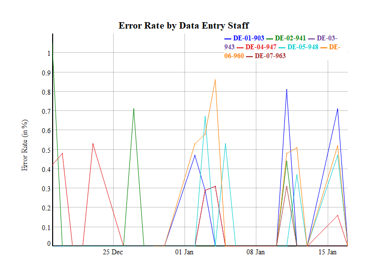
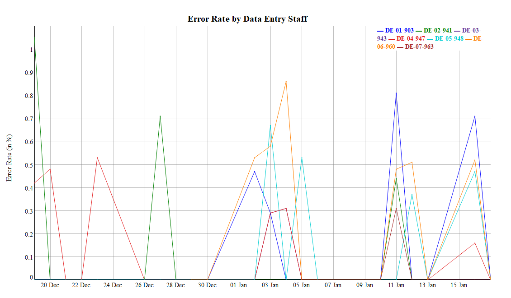

error rate by each data entry staff
================
Reynaldi Ikhsan Kosasih
2023-01-20

## in this example, I am going to demonstrate my capability in working with time series data. Case: I was asked to evaluate error rate of each data entry staff in the last month.

``` r
#these are my 'default' packages when working with r

library(ggplot2) #create advanced and sophisticating plot
library(tidyverse) #tidying columns, row, etc
```

    ## ── Attaching packages ─────────────────────────────────────── tidyverse 1.3.2 ──
    ## ✔ tibble  3.1.8      ✔ dplyr   1.0.10
    ## ✔ tidyr   1.2.1      ✔ stringr 1.4.1 
    ## ✔ readr   2.1.3      ✔ forcats 0.5.2 
    ## ✔ purrr   0.3.5      
    ## ── Conflicts ────────────────────────────────────────── tidyverse_conflicts() ──
    ## ✖ dplyr::filter() masks stats::filter()
    ## ✖ dplyr::lag()    masks stats::lag()

``` r
library(summarytools) #summary of basic statistics
```

    ## 
    ## Attaching package: 'summarytools'
    ## 
    ## The following object is masked from 'package:tibble':
    ## 
    ##     view

``` r
library(dplyr) #manipulate dataframe
library(readxl) #read excel file
library(writexl) #export to excel

error_rate_staff <- read_excel("D:/SID/Research Data Center/Daily Log and Performance Report - SID's Research Data Center.xlsx", sheet = "Staff Daily Performance", col_types = c("date", "text", "text", "numeric", "numeric", "numeric", "numeric", "text"))

error_rate_staff$error_rate <- (round(error_rate_staff$error_rate, 4) * 100) #convert error rate to a round number with two decimals for better readability
```

## R time series

``` r
library(tidyr) #convert long data to wide data (and vice versa)

df <- subset(error_rate_staff, select = c("date", "id_de", "error_rate"))
df <- df %>% filter(date >= '2022-12-18' & date <= '2023-01-18')
df2 <- pivot_wider(df, names_from = id_de, values_from = error_rate)

head(df2)
```

    ## # A tibble: 6 × 8
    ##   date                DE-01-90…¹ DE-02…² DE-03…³ DE-04…⁴ DE-05…⁵ DE-06…⁶ DE-07…⁷
    ##   <dttm>                   <dbl>   <dbl>   <dbl>   <dbl>   <dbl>   <dbl>   <dbl>
    ## 1 2022-12-19 00:00:00          0    1.05       0    0.42       0      NA      NA
    ## 2 2022-12-20 00:00:00          0    0          0    0.48       0      NA      NA
    ## 3 2022-12-21 00:00:00          0    0          0    0          0      NA      NA
    ## 4 2022-12-22 00:00:00          0    0          0    0          0      NA      NA
    ## 5 2022-12-23 00:00:00          0    0          0    0.53       0      NA      NA
    ## 6 2022-12-26 00:00:00          0    0          0    0          0      NA      NA
    ## # … with abbreviated variable names ¹​`DE-01-903`, ²​`DE-02-941`, ³​`DE-03-943`,
    ## #   ⁴​`DE-04-947`, ⁵​`DE-05-948`, ⁶​`DE-06-960`, ⁷​`DE-07-963`

``` r
#produce interactive graph

library(dygraphs)
library(xts) # To make the conversion data-frame / xts format
```

    ## Loading required package: zoo

    ## 
    ## Attaching package: 'zoo'

    ## The following objects are masked from 'package:base':
    ## 
    ##     as.Date, as.Date.numeric

    ## 
    ## Attaching package: 'xts'

    ## The following objects are masked from 'package:dplyr':
    ## 
    ##     first, last

``` r
dftime = xts(x=df2[,-1], order.by=df2$date)

p <- dygraph(dftime, main = "Error Rate by Data Entry Staff") %>%
      dyAxis("y", label = "Error Rate (in %)", valueRange = c(0, 1.1)) %>%
    dyGroup(c("DE-01-903", "DE-02-941", "DE-03-943", "DE-04-947", "DE-05-948", "DE-06-960", "DE-07-963"), drawPoints = TRUE, color = c("blue", "green", "#6A3D9A", "#E31A1C", "darkturquoise", "#FF7F00", "brown")) %>%
  dyOptions(axisLineWidth = 2, fillGraph = FALSE, drawGrid = TRUE) %>%
dyHighlight(highlightCircleSize = 5, 
              highlightSeriesBackgroundAlpha = 0.2,
              hideOnMouseOut = TRUE)
p
```

<!-- -->

``` r
#export to png image

library(htmlwidgets)
library(webshot)

saveWidget(p, "temp.html", selfcontained = FALSE)
width<- 1080
height <- 610
webshot("temp.html", file = "Rplot.png",
        cliprect = c(10,30,width+50,height+50)
        ,vwidth = width, vheight = height )
```

    ## Warning in is.null(x) || is.na(x): 'length(x) = 4 > 1' in coercion to
    ## 'logical(1)'

<!-- -->
