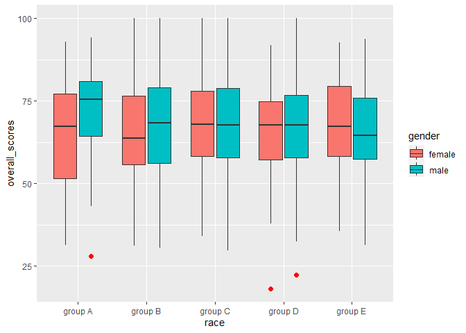

playing with data visualization using ggplot2 in R
================
Reynaldi Ikhsan Kosasih
2023-01-23

## Goals

In this mock-up example, I am going to demonstrate my capability in
using R for data visualization

This demonstration used an exam score dataset that consists of 1000
observations.

## load library

These are my ‘default’ packages when working with r

``` r
library(ggplot2) #create advanced and sophisticating plot
library(tidyverse) #tidying columns, row, etc
```

    ## ── Attaching packages ─────────────────────────────────────── tidyverse 1.3.2 ──
    ## ✔ tibble  3.1.8      ✔ dplyr   1.0.10
    ## ✔ tidyr   1.2.1      ✔ stringr 1.4.1 
    ## ✔ readr   2.1.3      ✔ forcats 0.5.2 
    ## ✔ purrr   0.3.5      
    ## ── Conflicts ────────────────────────────────────────── tidyverse_conflicts() ──
    ## ✖ dplyr::filter() masks stats::filter()
    ## ✖ dplyr::lag()    masks stats::lag()

``` r
library(flextable) #flextable are designed to make tabular reporting easier for R users
```

    ## 
    ## Attaching package: 'flextable'
    ## 
    ## The following object is masked from 'package:purrr':
    ## 
    ##     compose

``` r
library(summarytools) #summary of basic statistics
```

    ## 
    ## Attaching package: 'summarytools'
    ## 
    ## The following object is masked from 'package:tibble':
    ## 
    ##     view

``` r
library(dplyr) #manipulate dataframe
library(readxl) #read excel file
library(writexl) #export to excel

#create a value consists of 25 distinct colors for better plots customization and presentation
c25 <- c(
  "blue1", "#E31A1C", # red
  "green4",
  "#6A3D9A", # purple
  "#FF7F00", # orange
  "black", "gold1",
  "skyblue2", "#FB9A99", # lt pink
  "palegreen2",
  "#CAB2D6", # lt purple
  "#FDBF6F", # lt orange
  "gray70", "khaki2",
  "maroon", "orchid1", "deeppink1", "dodgerblue2", "steelblue4",
  "darkturquoise", "green1", "yellow4", "yellow3",
  "darkorange4", "brown"
)

# load dataset


df <- read_excel("D:/Portfolio/clone/exam score.xlsx", 
     col_types = c("text", "text", "text", 
         "text", "text", "text", "numeric", 
         "numeric", "numeric"))
head(df)
```

## create several new variables as variables of interest

I added several variables, which are overall scores (math \* .60 +
reading \* 0.20 + writing \* 0.20) and pass (yes or no). Those who
scored more than the minimum passing grade of 75 would pass the exam.

``` r
df$overall_scores <- (df$math_score * 0.60) + (df$reading_score * 0.20) + (df$writing_score * 0.20)
df$pass <- if_else(df$overall_scores >= 75, "yes", "no", missing = NULL)
```

## check descriptive analysis (frequency, distribution, etc)

``` r
freq(df$gender)
```

    ## Frequencies  
    ## df$gender  
    ## Type: Character  
    ## 
    ##                Freq   % Valid   % Valid Cum.   % Total   % Total Cum.
    ## ------------ ------ --------- -------------- --------- --------------
    ##       female    480     48.24          48.24     48.00          48.00
    ##         male    515     51.76         100.00     51.50          99.50
    ##         <NA>      5                               0.50         100.00
    ##        Total   1000    100.00         100.00    100.00         100.00

``` r
freq(df$race)
```

    ## Frequencies  
    ## df$race  
    ## Type: Character  
    ## 
    ##                 Freq   % Valid   % Valid Cum.   % Total   % Total Cum.
    ## ------------- ------ --------- -------------- --------- --------------
    ##       group A     78      7.85           7.85      7.80           7.80
    ##       group B    205     20.62          28.47     20.50          28.30
    ##       group C    321     32.29          60.76     32.10          60.40
    ##       group D    260     26.16          86.92     26.00          86.40
    ##       group E    130     13.08         100.00     13.00          99.40
    ##          <NA>      6                               0.60         100.00
    ##         Total   1000    100.00         100.00    100.00         100.00

``` r
freq(df$parental_education)
```

    ## Frequencies  
    ## df$parental_education  
    ## Type: Character  
    ## 
    ##                            Freq   % Valid   % Valid Cum.   % Total   % Total Cum.
    ## ------------------------ ------ --------- -------------- --------- --------------
    ##       associate's degree    203     20.30          20.30     20.30          20.30
    ##        bachelor's degree    112     11.20          31.50     11.20          31.50
    ##              high school    202     20.20          51.70     20.20          51.70
    ##          master's degree     70      7.00          58.70      7.00          58.70
    ##             some college    222     22.20          80.90     22.20          80.90
    ##         some high school    191     19.10         100.00     19.10         100.00
    ##                     <NA>      0                               0.00         100.00
    ##                    Total   1000    100.00         100.00    100.00         100.00

``` r
freq(df$lunch)
```

    ## Frequencies  
    ## df$lunch  
    ## Type: Character  
    ## 
    ##                      Freq   % Valid   % Valid Cum.   % Total   % Total Cum.
    ## ------------------ ------ --------- -------------- --------- --------------
    ##       free/reduced    347     34.91          34.91     34.70          34.70
    ##           standard    647     65.09         100.00     64.70          99.40
    ##               <NA>      6                               0.60         100.00
    ##              Total   1000    100.00         100.00    100.00         100.00

``` r
freq(df$test_preparation)
```

    ## Frequencies  
    ## df$test_preparation  
    ## Type: Character  
    ## 
    ##                   Freq   % Valid   % Valid Cum.   % Total   % Total Cum.
    ## --------------- ------ --------- -------------- --------- --------------
    ##       completed    335     33.50          33.50     33.50          33.50
    ##            none    665     66.50         100.00     66.50         100.00
    ##            <NA>      0                               0.00         100.00
    ##           Total   1000    100.00         100.00    100.00         100.00

``` r
freq(df$pass)
```

    ## Frequencies  
    ## df$pass  
    ## Type: Character  
    ## 
    ##               Freq   % Valid   % Valid Cum.   % Total   % Total Cum.
    ## ----------- ------ --------- -------------- --------- --------------
    ##          no    680     68.00          68.00     68.00          68.00
    ##         yes    320     32.00         100.00     32.00         100.00
    ##        <NA>      0                               0.00         100.00
    ##       Total   1000    100.00         100.00    100.00         100.00

``` r
descr(df$math_score)
```

    ## Descriptive Statistics  
    ## df$math_score  
    ## N: 1000  
    ## 
    ##                     math_score
    ## ----------------- ------------
    ##              Mean        66.45
    ##           Std.Dev        15.39
    ##               Min        13.00
    ##                Q1        56.00
    ##            Median        67.00
    ##                Q3        77.00
    ##               Max       100.00
    ##               MAD        16.31
    ##               IQR        21.00
    ##                CV         0.23
    ##          Skewness        -0.16
    ##       SE.Skewness         0.08
    ##          Kurtosis        -0.23
    ##           N.Valid      1000.00
    ##         Pct.Valid       100.00

``` r
descr(df$reading_score)
```

    ## Descriptive Statistics  
    ## df$reading_score  
    ## N: 1000  
    ## 
    ##                     reading_score
    ## ----------------- ---------------
    ##              Mean           69.04
    ##           Std.Dev           14.70
    ##               Min           27.00
    ##                Q1           60.00
    ##            Median           70.00
    ##                Q3           79.00
    ##               Max          100.00
    ##               MAD           14.83
    ##               IQR           19.00
    ##                CV            0.21
    ##          Skewness           -0.18
    ##       SE.Skewness            0.08
    ##          Kurtosis           -0.32
    ##           N.Valid         1000.00
    ##         Pct.Valid          100.00

``` r
descr(df$writing_score)
```

    ## Descriptive Statistics  
    ## df$writing_score  
    ## N: 1000  
    ## 
    ##                     writing_score
    ## ----------------- ---------------
    ##              Mean           67.70
    ##           Std.Dev           15.58
    ##               Min           23.00
    ##                Q1           58.00
    ##            Median           68.00
    ##                Q3           79.00
    ##               Max          100.00
    ##               MAD           16.31
    ##               IQR           21.00
    ##                CV            0.23
    ##          Skewness           -0.14
    ##       SE.Skewness            0.08
    ##          Kurtosis           -0.37
    ##           N.Valid         1000.00
    ##         Pct.Valid          100.00

``` r
descr(df$overall_scores)
```

    ## Descriptive Statistics  
    ## df$overall_scores  
    ## N: 1000  
    ## 
    ##                     overall_scores
    ## ----------------- ----------------
    ##              Mean            67.22
    ##           Std.Dev            14.56
    ##               Min            18.20
    ##                Q1            57.20
    ##            Median            67.40
    ##                Q3            77.60
    ##               Max           100.00
    ##               MAD            15.12
    ##               IQR            20.40
    ##                CV             0.22
    ##          Skewness            -0.17
    ##       SE.Skewness             0.08
    ##          Kurtosis            -0.33
    ##           N.Valid          1000.00
    ##         Pct.Valid           100.00

## using ggplot package to create plots (histogram to observe the distribution)

``` r
p1 <- ggplot(df, aes(x = overall_scores)) + geom_histogram(binwidth = 3, color="white", fill="lightblue") + geom_vline(aes(xintercept=75), color="maroon", linetype="dashed", size=1) + ggtitle("overall scores of 1000 students") + xlab("overall scores") + ylab("number of students") + scale_y_continuous(limits = c(0, 100), breaks = seq(0, 100, by = 20)) # adding vertical line of passing grade (75)
```

    ## Warning: Using `size` aesthetic for lines was deprecated in ggplot2 3.4.0.
    ## ℹ Please use `linewidth` instead.

``` r
p1
```

<!-- -->

``` r
# export jpeg file

jpeg(file="histogram overall score.jpeg")
p1
dev.off()
```

    ## png 
    ##   2

## overlaid histogram to compare the overall score between men and women

``` r
p2 <- ggplot(data=subset(df, !is.na(gender)), aes(x = overall_scores, color = gender)) + geom_histogram(binwidth = 3, fill="white", alpha=0.2, position = "identity") + geom_vline(aes(xintercept=75), color="maroon", linetype="dashed", size=1) + ggtitle("overall scores of 1000 students, men and women") + xlab("overall scores") + ylab("number of students") + scale_y_continuous(limits = c(0, 60), breaks = seq(0, 60, by = 10)) + scale_color_manual(values = c25)

p2
```

<!-- -->

## scatterplot for math score, reading score, and writing score

``` r
# Plot with main and axis titles
library(car)
```

    ## Loading required package: carData

    ## 
    ## Attaching package: 'car'

    ## The following object is masked from 'package:dplyr':
    ## 
    ##     recode

    ## The following object is masked from 'package:purrr':
    ## 
    ##     some

``` r
scatterplot(writing_score ~ reading_score, data = df, grid = TRUE, frame = TRUE, main = "Scatterplot of Reading Score and Writing Score", xlab = "Reading Score", ylab = "Writing Score")
```

<!-- -->

``` r
# 3d scatterplot

library(scatterplot3d)

x <- df$math_score
y <- df$reading_score
z <- df$writing_score
grp <- as.factor(df$gender)

scatterplot3d(x, y, z, pch = 16, color = c25[grp],
              grid = TRUE, box = FALSE, xlab = "Math Score", 
              ylab = "Reading Score", zlab = "Writing Score")
legend("right", legend = levels(grp),
      col =  c25[grp], pch = 16)
```

<!-- -->
\## box plot by race and gender to observe outlier (if any, indicated by
red dots)

``` r
bp <- ggplot(data=subset(df, !is.na(race) & !is.na(gender)), aes(x=race, y=overall_scores, fill=gender)) + geom_boxplot(outlier.colour="red", outlier.shape=16,outlier.size=2, notch=FALSE) + scale_color_manual(values=c25)
bp
```

<!-- -->
